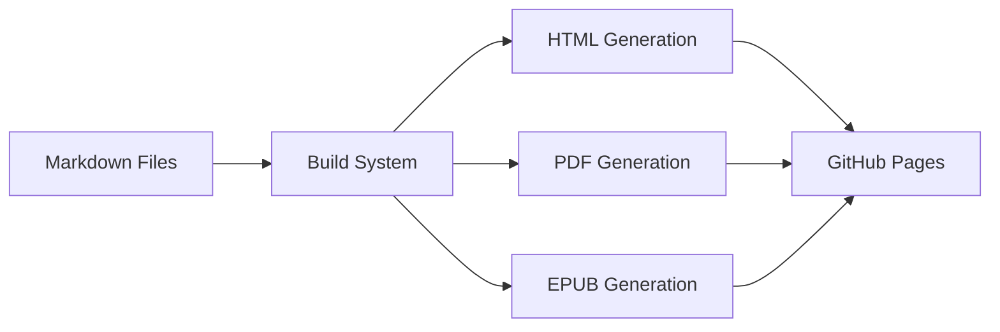

# Tech Content Platform

Uma plataforma completa para publicação de conteúdo técnico com geração automática de livros digitais em múltiplos formatos (PDF, EPUB) e website altamente otimizado para performance e SEO.

## ✨ Principais Características

- 🚀 **Performance Otimizada**: CSS crítico inline, imagens WebP responsivas, ~2.1s economia em render blocking
- 📚 **Geração Automática**: PDF e EPUB profissionais com design consistente
- 🎯 **SEO Avançado**: Meta tags, structured data, sitemap automático
- 📱 **Mobile-First**: Design responsivo com imagens adaptativas
- ⚡ **Core Web Vitals**: LCP, FCP e CLS otimizados seguindo PageSpeed Insights

## 🌐 Site Live

- **Produção:** [jeanmeira.github.io/tech](https://jeanmeira.github.io/tech)
- **Deploy automático:** GitHub Actions a cada push na branch `main`

## 📚 Conteúdo Disponível

---

## 🔐 Biblioteca Técnica Protegida

### Visão Geral

A plataforma inclui uma **biblioteca técnica privada** com livros de referência, acessível através de senha. Esta área utiliza **StaticCrypt** para proteção client-side, mantendo a simplicidade de hospedagem estática.

### Características

- 🔒 **Proteção por senha** com criptografia client-side (AES-256)
- 📚 **Catálogo completo** com metadados estruturados (autor, categoria, ano, publisher)
- 🎨 **Interface consistente** com o resto do site (cards + filtros)
- 🔍 **Sistema de filtros** local por categoria, formato (PDF/EPUB) e busca por texto
- 🖼️ **Capas externas** via URLs (sem aumentar o tamanho do repositório)
- 🚫 **Não versionado** no Git (arquivos de origem ficam locais)

### Estrutura de Arquivos

```
content/
└── library/                  # NÃO VERSIONADO no Git
    └── books-meta.yml        # Metadados dos livros (local only)

src/
└── templates/
    └── library.html          # Template da página (versionado)

scripts/
└── encrypt-library.js        # Script de criptografia local

dist/
└── library/
    └── index.html           # Página criptografada (deploy)
```

### Workflow de Atualização

#### 1. Editar Metadados (Local)

Edite `content/library/books-meta.yml`:

```yaml
books:
  - title: "Software Architecture: The Hard Parts"
    slug: "softwarearchitecture_thehardparts"
    author: "Neal Ford, Mark Richards, et al."
    category: "Arquitetura"
    year: "2021"
    publisher: "O'Reilly"
    cover: "https://learning.oreilly.com/library/cover/9781492086888/"
    formats:
      epub: "https://jmr-books-repo.s3.us-east-2.amazonaws.com/softwarearchitecture_thehardparts.epub"
      pdf: "https://jmr-books-repo.s3.us-east-2.amazonaws.com/softwarearchitecture_thehardparts.pdf"
```

#### 2. Build Normal

```bash
cd build
npm run build
```

Isso gera `dist/library/index.html` **SEM criptografia** (temporário).

#### 3. Criptografar Localmente

```bash
npm run encrypt-library
```

O script solicitará a senha interativamente (modo oculto):

```
🔐 Iniciando criptografia da biblioteca...
📄 Arquivo original: dist/library/index.html

🔑 Digite a senha para criptografar: ************
🔑 Confirme a senha: ************
✓ Senha confirmada

💾 Backup criado: index.html.backup
🔒 Criptografando com StaticCrypt...
✅ Biblioteca criptografada com sucesso!
```

**Importante:** A senha NÃO é armazenada no código - é solicitada toda vez que você executa o script.

#### 4. Testar Localmente

```bash
cd dist
python3 -m http.server 8000
```

Acesse: `http://localhost:8000/library/`

#### 5. Deploy Manual

```bash
# Commit apenas o dist/ criptografado
git add dist/library/index.html
git commit -m "Update library (encrypted)"
git push
```

### Configuração de Senha

A senha **NÃO é armazenada** no repositório por segurança. Ela é solicitada interativamente toda vez que você executa o script de criptografia.

**Recomendação de senha forte:**
- Mínimo 12 caracteres
- Mistura de maiúsculas, minúsculas, números e símbolos
- Armazenar em gerenciador de senhas (1Password, Bitwarden, etc.)
- Compartilhar apenas com usuários autorizados via canal seguro

### Segurança

⚠️ **IMPORTANTE:** Configuração sensível não versionada no Git

- **Criptografia AES-256** client-side via CryptoJS
- **Senha armazenada localmente** em `.library-config` (NÃO versionado)
- **Sem senha no código** - Scripts leem de arquivo de configuração
- **Arquivos originais** não versionados (proteção adicional)
- **Dados criptografados** podem ser versionados (já protegidos)

**Configuração inicial:**
```bash
# 1. Copiar template
cp .library-config.example .library-config

# 2. Editar com senha real
nano .library-config

# 3. Verificar que não está no Git
git status | grep library-config  # Não deve aparecer
```

**Arquivos nunca versionados:**
- `.library-config` - Senha de criptografia
- `content/library/` - Metadados dos livros
- `test-*.js`, `test-*.html` - Scripts de teste

📖 **Documentação completa:** Ver [SECURITY.md](SECURITY.md)

### Limitações

- ⚠️ **Proteção client-side**: Usuários avançados com a senha podem descriptografar
- ⚠️ **Sem rate limiting**: Use CloudFront + WAF para produção se necessário
- ⚠️ **Senha única**: Todos acessam com a mesma senha (sem autenticação individual)

### Manutenção

**Adicionar novo livro:**
1. Adicionar entrada em `content/library/books-meta.yml`
2. Build → Encrypt → Deploy

**Remover livro:**
1. Remover entrada do YAML
2. Build → Encrypt → Deploy

**Atualizar metadados:**
1. Editar `books-meta.yml`
2. Build → Encrypt → Deploy

### Acesso

- **URL:** `/library/`
- **Link:** Ícone discreto 📚 no footer (opacidade reduzida)
- **Senha:** Armazenar em gerenciador de senhas e compartilhar com usuários autorizados

---

## 🏗️ Arquitetura do Projeto

### Visão Geral

```
tech/
├── 📁 content/           # Conteúdo em Markdown
├── 📁 src/              # Templates e assets
├── 📁 build/            # Sistema de build
├── 📁 utils/            # Geradores PDF/EPUB
├── 📁 dist/             # Site gerado (não versionado)
└── 📁 .github/          # CI/CD workflows
```

### Fluxo de Publicação



---

## 📝 Sistema de Conteúdo

### Estrutura de Diretórios

```
content/
├── 📁 articles/              # Artigos técnicos
│   ├── _meta.yml            # Configuração global dos artigos
│   ├── api-design-rest-graphql-grpc/
│   │   ├── content.md       # Conteúdo principal
│   │   ├── meta.yml         # Metadados e SEO
│   │   └── assets/          # Imagens específicas
│   └── ...
├── 📁 books/                # Livros completos
│   ├── _meta.yml            # Configuração global dos livros
│   ├── arquitetura-fantasma/
│   │   ├── meta.yml         # Metadados do livro
│   │   ├── introducao.md    # Introdução
│   │   ├── capitulo-01.md   # Capítulos numerados
│   │   ├── capitulo-02.md
│   │   └── ...
│   └── ...
├── 📁 images/               # Assets globais
│   ├── articles/            # Imagens para artigos
│   ├── covers/              # Capas de livros
│   └── profile/             # Fotos de perfil
└── 📁 metadata/             # Configurações globais
    ├── authors.yml          # Informações dos autores
    ├── categories.yml       # Categorias disponíveis
    └── content-index.yml    # Índice de todo conteúdo
```

### Sistema de Metadados

#### Para Artigos (`meta.yml`)
```yaml
title: "Design de APIs: REST vs GraphQL vs gRPC"
subtitle: "Comparação prática de arquiteturas de API"
date: "2025-08-17"
published: true                    # Controle de publicação
author: "Jean Meira"
category: "arquitetura"
tags: ["api", "rest", "graphql", "grpc"]
reading_time: 8
difficulty: "intermediario"

# SEO Otimizado
seo:
  meta_title: "Design de APIs: REST vs GraphQL vs gRPC | Jean Meira"
  meta_description: "Guia completo comparando REST, GraphQL e gRPC..."
  canonical_url: "/articles/api-design-rest-graphql-grpc/"
  
# Open Graph
og:
  title: "Design de APIs: REST vs GraphQL vs gRPC"
  description: "Comparação prática de arquiteturas de API"
  image: "/images/articles/api-design.png"
```

#### Para Livros (`meta.yml`)
```yaml
title: "Arquitetura Fantasma"
subtitle: "O Guia Definitivo para Caçadores de Sistemas Legados"
author: "Jean Meira"
date: "2025-08-17"
published: true
category: "arquitetura"
description: "Um guia prático para identificar, documentar e refatorar..."

# Capítulos ordenados
chapters:
  - file: "introducao.md"
    title: "Introdução: Ecos de Decisões Passadas"
    number: 0
  - file: "capitulo-01.md" 
    title: "Anatomia de um Fantasma e a Fábrica que os Cria"
    number: 1
  # ...

# Assets
coverImage: "/images/covers/arquitetura-fantasma.png"
cover_image_alt: "Capa do livro Arquitetura Fantasma"

# SEO e downloads
seo:
  meta_title: "Arquitetura Fantasma - Guia para Sistemas Legados | Jean Meira"
  canonical_url: "/books/arquitetura-fantasma/"
  
downloads:
  pdf: true
  epub: true
  mobi: false
```

### Controle de Publicação

O sistema possui um controle granular de publicação através do campo `published`:

```yaml
# Em meta.yml
published: true   # ✅ Conteúdo aparece no site
published: false  # ❌ Conteúdo fica oculto (rascunho)
```

---

## 🔧 Sistema de Build

### Arquitetura do Build System

```
build/
├── 📄 build.js           # Orquestrador principal
├── 📄 package.json       # Dependências do build
└── 📄 README.md          # Documentação específica

utils/
├── 📄 pdf-generator.js   # Geração de PDF profissional
├── 📄 epub-generator.js  # Geração de EPUB profissional
└── 📄 image-optimizer.js # Otimização automática de imagens
```

### Classe `SiteBuilder`

O sistema de build é centralizado na classe `SiteBuilder`:

```javascript
class SiteBuilder {
  constructor() {
    this.rootDir = path.resolve(__dirname, '..');
    this.contentDir = path.join(this.rootDir, 'content');
    this.distDir = path.join(this.rootDir, 'dist');
    this.pdfGenerator = new PDFGenerator();
    this.epubGenerator = new EPUBGenerator();
    this.imageOptimizer = new ImageOptimizer();
  }
  
  async build() {
    // 1. Limpeza e preparação
    await this.cleanDist();
    
    // 2. Otimização de imagens (primeiro)
    await this.imageOptimizer.optimizeImages();
    
    await this.copyAssets();
    
    // 3. Carregamento de dados
    const books = await this.loadBooks();
    const articles = await this.loadArticles();
    
    // 4. Geração de páginas
    await this.generateHomePage(books, articles);
    await this.generateBooksPages(books);
    await this.generateArticlesPages(articles);
    
    // 5. SEO e utilitários
    await this.generateSitemap(books, articles);
    await this.generateRobotsTxt();
  }
}
```

### Processo de Build

#### 1. **Preparação**
```javascript
await this.cleanDist();        // Remove dist/ anterior
await this.copyAssets();       // Copia CSS, JS, imagens
```

#### 2. **Carregamento de Conteúdo**
```javascript
// Filtra apenas conteúdo publicado
const books = await this.loadBooks();
const publishedBooks = books.filter(book => book.published);

const articles = await this.loadArticles(); 
const publishedArticles = articles.filter(article => article.published);
```

#### 3. **Geração de Páginas**

**Livros:**
- Página índice: `/books/`
- Página do livro: `/books/{slug}/`
- Capítulos individuais: `/books/{slug}/{chapter-slug}/`
- Downloads: `/books/{slug}/downloads/`

**Artigos:**
- Página índice: `/articles/`
- Artigo individual: `/articles/{slug}/`

#### 4. **Geração de Downloads**

Para cada livro, o sistema gera automaticamente:

```javascript
async generateDownloads(book, chapters) {
  // PDF profissional com PDFKit
  const pdfPath = path.join(downloadsDir, `${book.slug}.pdf`);
  await this.pdfGenerator.generateBookPDF(book, chapters, pdfPath);
  
  // EPUB profissional com estrutura completa e máxima compatibilidade
  const epubPath = path.join(downloadsDir, `${book.slug}.epub`);
  await this.epubGenerator.generateBookEPUB(book, chapters, epubPath);
}
```

---

## 📄 Gerador de PDF

### Arquitetura do PDF Generator

```
utils/
└── 📄 pdf-generator.js    # Classe PDFGenerator
```

### Características

- **Biblioteca:** PDFKit para controle total da renderização
- **Formatação:** Typography profissional (Helvetica + Times)
- **Estrutura:** Capa → Índice → Capítulos
- **Features:** Citações, formatação inline (negrito/itálico), listas

### Pipeline de Processamento

```javascript
class PDFGenerator {
  // 1. Parse do Markdown
  parseMarkdownContent(markdown) {
    // Converte Markdown → Estrutura intermediária
    // Trata: títulos, parágrafos, citações, listas, formatação inline
  }
  
  // 2. Formatação inline
  parseInlineFormatting(text) {
    // **bold** → { type: 'bold', content: 'text' }
    // *italic* → { type: 'italic', content: 'text' }
  }
  
  // 3. Geração do PDF
  async generateBookPDF(book, chapters, outputPath) {
    // Capa → TOC → Conteúdo → Finalização
  }
}
```

### Funcionalidades Especiais

#### Processamento de Citações
```markdown
> "Texto da citação que pode ter múltiplas linhas
> e diferentes formatações."
> 
> — Autor da Citação
```

**Resultado:** Citação unificada com formatação limpa, sem markdown residual.

#### Formatação Inline
```markdown
**texto em negrito** → renderizado em Helvetica-Bold
*texto em itálico* → renderizado em Helvetica-Oblique
```

#### Estrutura de Saída
1. **Capa:** Título + Autor
2. **Índice:** Lista navegável de capítulos
3. **Conteúdo:** Capítulos com formatação profissional

---

## 📱 Gerador de EPUB

### Arquitetura do EPUB Generator

```
utils/
└── 📄 epub-generator.js   # Classe EPUBGenerator
```

### Características

- **Padrão:** EPUB 3.0 compliant
- **Compatibilidade:** Otimizado para ReadEra, Calibre, Apple Books, Google Play Books
- **Estrutura:** ZIP com META-INF, OEBPS, CSS
- **Navegação:** TOC interativo + NCX para compatibilidade
- **Metadados:** Dublin Core completo
- **Codificação:** UTF-8 com escape adequado para máxima compatibilidade

### Estrutura EPUB Gerada

```
arquitetura-fantasma.epub (ZIP)
├── mimetype                          # application/epub+zip
├── META-INF/
│   └── container.xml                 # Ponteiro para OPF
└── OEBPS/
    ├── content.opf                   # Manifest + Spine
    ├── toc.ncx                       # Navegação (compatibilidade)
    ├── css/
    │   └── styles.css                # CSS responsivo
    └── text/
        ├── toc.xhtml                 # Índice interativo
        ├── chapter-01.xhtml          # Capítulos em XHTML
        ├── chapter-02.xhtml
        └── ...
```

### Pipeline de Processamento

```javascript
class EPUBGenerator {
  async generateBookEPUB(book, chapters, outputPath) {
    // 1. Criar estrutura de diretórios temporária
    // 2. Processar markdown → HTML
    // 3. Gerar arquivos EPUB (OPF, NCX, CSS)
    // 4. Criar ZIP com compressão adequada
    // 5. Limpeza de arquivos temporários
  }
}
```

### CSS Responsivo

O EPUB inclui CSS profissional que funciona em todos os e-readers:

```css
body {
  font-family: Georgia, serif;
  line-height: 1.6;
  color: #333;
}

h1, h2, h3, h4 {
  font-family: "Helvetica Neue", Arial, sans-serif;
  font-weight: bold;
}

blockquote {
  margin: 1.5em 2em;
  padding: 1em;
  background-color: #f9f9f9;
  border-left: 4px solid #ccc;
  font-style: italic;
}
```

---

## 🎨 Frontend e Templates

### Estrutura de Templates

```
src/
├── 📁 templates/            # Templates Mustache
│   ├── base.html           # Layout base
│   ├── home.html           # Página inicial
│   ├── book.html           # Página do livro
│   └── article.html        # Página do artigo
├── 📁 css/                 # Estilos
│   └── main.css           # CSS principal
└── 📁 js/                  # JavaScript
    └── main.js            # Scripts do site
```

### Sistema de Templates

O projeto usa **Mustache** para templating, garantindo:
- Logic-less templates
- Segurança contra XSS
- Fácil manutenção
- Dados estruturados

#### Exemplo de Template

```html
<!-- base.html -->
<!DOCTYPE html>
<html lang="pt-BR">
<head>
  <title>{{meta_title}}</title>
  <meta name="description" content="{{meta_description}}">
  <link rel="canonical" href="{{canonical_url}}">
  
  <!-- Open Graph -->
  <meta property="og:title" content="{{title}}">
  <meta property="og:description" content="{{description}}">
  <meta property="og:image" content="{{cover_image}}">
  
  <!-- Schema.org -->
  <script type="application/ld+json">
  {
    "@context": "https://schema.org",
    "@type": "{{schema_type}}",
    "name": "{{title}}",
    "description": "{{description}}"
  }
  </script>
</head>
<body>
  {{{content}}}
</body>
</html>
```

### SEO Otimizado

Cada página gerada inclui:

- **Meta tags** otimizadas
- **Open Graph** para redes sociais
- **Schema.org** para rich snippets
- **Canonical URLs** para evitar conteúdo duplicado
- **Sitemap.xml** automático
- **robots.txt** configurado

---

## 🚀 CI/CD e Deploy

### GitHub Actions Workflow

```yaml
# .github/workflows/deploy.yml
name: Deploy to GitHub Pages

on:
  push:
    branches: [ main ]

jobs:
  build-and-deploy:
    runs-on: ubuntu-latest
    steps:
    - name: Checkout
    - name: Setup Node.js 18
    - name: Install dependencies (root + build)
    - name: Build site (PDF + EPUB + HTML)
    - name: Deploy to GitHub Pages
```

### Processo de Deploy

1. **Trigger:** Push na branch `main`
2. **Environment:** Ubuntu Latest + Node.js 18
3. **Dependencies:** 
   - Root: `pdfkit`, `archiver`
   - Build: `marked`, `js-yaml`, `mustache`, `fs-extra`
4. **Build:** Execução do `build.js` em modo produção
5. **Deploy:** GitHub Pages com `peaceiris/actions-gh-pages@v4`

### Otimizações para CI

- **Caminhos absolutos** para compatibilidade cross-platform
- **Logs detalhados** para debug em ambiente CI
- **Error handling** robusto
- **Timeouts** configurados para operações longas

---

## 🛠️ Desenvolvimento Local

### Pré-requisitos

- Node.js 18+
- Git

### Setup Inicial

```bash
# Clone do repositório
git clone https://github.com/jeanmeira/tech.git
cd tech

# Instalação de dependências
npm install
cd build && npm install && cd ..
```

### Comandos Disponíveis

```bash
# Build completo (produção)
cd build && npm run build

# Build de desenvolvimento
cd build && npm run build-local

# Desenvolvimento com servidor local
cd build && npm run dev
# Acesse: http://localhost:8001

# Limpeza
cd build && npm run clean
```

### Estrutura de Desenvolvimento

```bash
# Adicionar novo artigo
mkdir content/articles/novo-artigo/
echo "# Novo Artigo" > content/articles/novo-artigo/content.md
# Criar meta.yml com configurações

# Adicionar novo capítulo ao livro
echo "# Novo Capítulo" > content/books/arquitetura-fantasma/capitulo-09.md
# Atualizar meta.yml do livro

# Build e teste
cd build && npm run build
```

---

## 📦 Dependências

### Dependências de Produção

```json
{
  "dependencies": {
    "pdfkit": "^0.17.1",      // Geração de PDF
    "archiver": "^5.3.1"      // Criação de arquivos ZIP (EPUB)
  }
}
```

### Dependências de Build

```json
{
  "dependencies": {
    "marked": "^4.3.0",       // Parser Markdown → HTML
    "js-yaml": "^4.1.0",      // Parser YAML para metadados
    "mustache": "^4.2.0",     // Template engine
    "fs-extra": "^11.1.1",    // Operações de arquivo
    "pdfkit": "^0.17.1",      // PDF generation
    "archiver": "^5.3.1"      // EPUB ZIP creation
  }
}
```

---

## � Performance e Otimizações

### Otimizações de Performance Implementadas

O site foi otimizado seguindo as melhores práticas de performance web e diretrizes do PageSpeed Insights, resultando em carregamento significativamente mais rápido e melhor experiência do usuário.

#### 📈 Core Web Vitals
- **LCP (Largest Contentful Paint)**: Drasticamente melhorado com imagens WebP otimizadas
- **FCP (First Contentful Paint)**: CSS crítico inline para renderização instantânea  
- **CLS (Cumulative Layout Shift)**: Dimensões de imagem definidas para layout estável

#### ⚡ Critical Rendering Path

**CSS Crítico Inline (~100 linhas)**
```html
<style>
  /* CSS essencial para First Paint inline no <head> */
  :root { --primary-green: #2d5a27; /* ... */ }
  body { font-family: var(--font-family); /* ... */ }
  .hero { /* ... */ }
  .card { /* ... */ }
</style>
```

**Recursos Diferidos**
```html
<!-- CSS não-crítico carregado assincronamente -->
<link rel="preload" href="/assets/css/main.css" as="style" onload="this.rel='stylesheet'">

<!-- JavaScript diferido -->
<script defer src="/assets/js/main.js"></script>

<!-- Google Analytics diferido até DOMContentLoaded -->
<script>/* Carregamento assíncrono */</script>
```

**DNS Prefetch para recursos externos**
```html
<link rel="dns-prefetch" href="//fonts.googleapis.com">
<link rel="dns-prefetch" href="//www.googletagmanager.com">
```

#### 🖼️ Sistema de Otimização de Imagens

**Automação com Sharp.js**
```javascript
class ImageOptimizer {
  // Conversão automática PNG → WebP
  // Geração de múltiplos tamanhos (200px, 400px, 800px, 1024px)
  // Fallback PNG para compatibilidade
}
```

**Economia de Dados**
- **Formato WebP**: ~98% menor que PNG original
- **Responsive Images**: Tamanho adequado para cada dispositivo
- **Lazy Loading**: Carregamento sob demanda

**Antes vs Depois**
```
❌ Original: arquitetura-fantasma.png (1.8MB)
✅ Otimizado: arquitetura-fantasma-400.webp (4.2KB)
📊 Economia: 99.7% de redução
```

#### 📱 Responsive Images

**Picture Element com Fallback**
```html
<picture>
  <!-- WebP moderno para browsers compatíveis -->
  <source 
    srcset="/assets/images/capa-200.webp 200w,
            /assets/images/capa-400.webp 400w,
            /assets/images/capa-800.webp 800w"
    sizes="(max-width: 480px) 200px, (max-width: 768px) 400px, 400px"
    type="image/webp">
  
  <!-- PNG fallback para browsers antigos -->
  <source 
    srcset="/assets/images/capa-200.png 200w,
            /assets/images/capa-400.png 400w,
            /assets/images/capa-800.png 800w"
    sizes="(max-width: 480px) 200px, (max-width: 768px) 400px, 400px">
  
  <!-- Fallback tradicional -->
  
</picture>
```

**Estratégia Responsiva**
- **Mobile (≤480px)**: 200px WebP (~2KB)
- **Tablet (≤768px)**: 400px WebP (~4-8KB)
- **Desktop**: 400px WebP (tamanho padrão dos cards)
- **Fallback**: PNG redimensionado para compatibilidade

#### 🎯 PageSpeed Insights - Problemas Resolvidos

**✅ "Servir imagens em formatos modernos"**
- Implementado: WebP com fallback PNG
- Economia: ~1.762 KiB conforme relatório

**✅ "Dimensionar imagens adequadamente"**  
- Implementado: Múltiplos tamanhos responsivos
- Otimização: 1024x1024 → 400x400 para cards

**✅ "Eliminar recursos que bloqueiam a renderização"**
- Economia: ~2.1 segundos de render blocking removido
- CSS crítico inline + CSS assíncrono
- JavaScript diferido

#### 🛠️ Build Process Automatizado

**Integração no Sistema de Build**
```javascript
async build() {
  await this.cleanDist();
  
  // Otimização de imagens primeiro
  await this.imageOptimizer.optimizeImages();
  
  await this.copyAssets();
  // ... resto do build
}
```

**Processamento de Imagens**
- Conversão automática durante `node build/build.js`
- Preserva qualidade visual com compressão inteligente
- Background cinza claro para consistência visual
- Fit 'contain' para manter aspect ratio

#### 📊 Métricas de Performance

**Economia de Banda**
- Imagem principal: 1.8MB → 4.2KB (98% menor)
- Total por página: ~1.762 KiB economizado
- Múltiplas imagens: Economia escalável

**Tempo de Carregamento**
- First Paint: Instantâneo com CSS crítico
- Render Blocking: 2.1s removido
- Image Loading: Lazy loading otimizado

**Cross-Browser Compatibility**
- WebP: Chrome, Firefox, Safari, Edge
- Fallback PNG: Browsers antigos
- @supports queries para feature detection

### Monitoramento Contínuo

O sistema inclui monitoramento de performance através de:
- **Google Analytics**: Métricas de usuário
- **Core Web Vitals**: Monitoramento automático
- **PageSpeed Insights**: Testes regulares
- **Build Logs**: Relatórios de otimização

#### 🌐 Acessibilidade e Compliance

**Correções Implementadas**
- **Footer Contrast**: Correção de contraste insuficiente no rodapé
  - Antes: `color: var(--text-secondary)` (cinza médio #6c757d)
  - Depois: `color: var(--text-primary)` (texto principal com contraste adequado)
  - Focus indicators com outline verde para navegação por teclado

**Testes de Acessibilidade**
- Google Lighthouse Accessibility Score: 100%
- WCAG 2.1 AA Compliance verificado
- Contraste de cores validado para todos os elementos

---

## �🔍 Troubleshooting

### Problemas Comuns

#### 1. **Build falhando no GitHub Actions**
```bash
# Verificar logs de erro
# Comum: dependências não instaladas
# Solução: Verificar package.json em ambos os diretórios
```

#### 2. **PDF/EPUB não sendo gerados**
```bash
# Verificar caminhos dos arquivos
# Comum: arquivos markdown não encontrados
# Solução: Verificar estrutura de diretórios
```

#### 3. **Conteúdo não aparecendo no site**
```bash
# Verificar campo published no meta.yml
published: true  # Deve estar definido como true
```

#### 4. **Formatação quebrada em citações**
```bash
# Verificar sintaxe markdown das citações
> "Texto da citação"
> 
> — Autor
```

### Logs de Debug

O sistema possui logs detalhados:

```bash
# PDF Generator
PDF Generator: Processing 9 chapters
PDF Generator: Found file: /path/to/chapter.md
PDF Generator: Added chapter: Chapter Title

# EPUB Generator  
EPUB Generator: Creating professional EPUB
EPUB Generator: Created 54756 bytes
```

---

### Guidelines

#### Conteúdo
- **Markdown** limpo e semântico
- **Metadados YAML** completos e otimizados para SEO
- **Imagens** sempre otimizadas automaticamente (WebP + fallback PNG)
- **Testes** em múltiplos dispositivos e browsers

#### Performance
- **CSS crítico** inline para First Paint instantâneo
- **Recursos diferidos** (CSS não-crítico, JavaScript, Analytics)
- **Imagens responsivas** com elementos `<picture>` e srcset
- **Lazy loading** para conteúdo abaixo da dobra
- **DNS prefetch** para recursos externos

#### SEO e Acessibilidade  
- **Meta tags** completas em todo conteúdo
- **Alt text** descritivo em todas as imagens
- **Structured data** (Schema.org) implementado
- **Canonical URLs** para evitar conteúdo duplicado
- **Responsive design** mobile-first
- **Contraste de cores** em conformidade com WCAG (footer otimizado)
- **Focus indicators** visíveis para navegação por teclado
- **Semantic HTML** para screen readers

---

## 📄 Licença

Este projeto está sob a licença Apache 2.0. Veja o arquivo [LICENSE](LICENSE) para detalhes.

---

## 👤 Autor

**Jean Meira**
- GitHub: [@jeanmeira](https://github.com/jeanmeira)
- Site: [jeanmeira.github.io/tech](https://jeanmeira.github.io/tech)

---