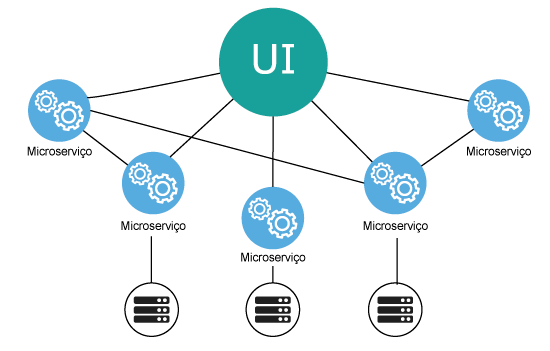

# Arquitetura de Microsserviços: Teoria vs Prática

A arquitetura de microsserviços virou quase um dogma na indústria de tecnologia. Todo mundo fala sobre ela, muitas empresas tentam implementar, mas poucos discutem honestamente os desafios reais e quando **não** usar esta abordagem.

Após anos implementando e mantendo sistemas distribuídos, quero compartilhar uma visão pragmática sobre microsserviços - incluindo quando são uma péssima ideia.




## O Que São Microsserviços (Realmente)

Microsserviços não são apenas "serviços pequenos". São uma abordagem arquitetural que prioriza:

- **Autonomia de serviços**: Cada serviço pode ser desenvolvido e deployado independentemente
- **Responsabilidade única**: Cada serviço resolve um problema específico de negócio
- **Comunicação via rede**: Serviços se comunicam através de APIs bem definidas
- **Descentralização**: Dados, governance e decisões técnicas são distribuídas


### O Espectro Arquitetural

```
Monolito → Monolito Modular → SOA → Microsserviços → Funções (Serverless)
```

Microsserviços não são binários - existe um espectro de granularidade que precisa ser calibrado para cada contexto.

## Quando Microsserviços Fazem Sentido

### Cenários Ideais

1. **Organização com múltiplos times**
   - Cada time pode ter ownership completo de um serviço
   - Conway's Law: sua arquitetura reflete sua estrutura organizacional

2. **Diferentes tecnologias por contexto**
   - Sistema de recomendação em Python/ML
   - API de pagamentos em Java/alta performance
   - Interface web em Node.js/React

3. **Escalabilidade diferenciada**
   - Serviço de notificações precisa escalar diferente de autenticação
   - Custos podem ser otimizados por componente

4. **Ciclos de release diferentes**
   - Core business muda raramente
   - Features experimentais mudam constantemente

### Pré-requisitos Organizacionais

- **DevOps maduro**: CI/CD, monitoring, alerting
- **Cultura de ownership**: Times responsáveis por todo o ciclo de vida
- **Investimento em tooling**: Service mesh, observabilidade, debugging distribuído

## Os Custos Ocultos

### Complexidade Operacional

```
1 aplicação → 1 deployment
10 microsserviços → 10 deployments × N ambientes × M configurações
```

Você troca complexidade de código por complexidade operacional. Nem sempre é um bom trade-off.

### Debugging Distribuído

Quando algo quebra em produção:

**Monolito**: 
- Stack trace completo
- Logs centralizados
- Debug local reproduz o problema

**Microsserviços**:
- Trace através de 5+ serviços
- Logs distribuídos
- Reprodução local complexa
- Network failures intermitentes

### Performance e Latência

```
Monolito: function_call() // ~1ns
Microsserviços: HTTP_request() // ~1-100ms
```

Cada call entre serviços adiciona latência. Designs ingênuos podem multiplicar latência por 10x ou mais.

### Consistência de Dados

- **ACID transactions** funcionam dentro de um serviço
- **Eventual consistency** entre serviços
- **Saga patterns** para workflows complexos
- **Data synchronization** entre bounded contexts

## Quando NÃO Usar Microsserviços

### 1. Times Pequenos (< 20 pessoas)
Se você tem um time pequeno, a overhead de coordenação entre serviços vai consumir mais tempo que a velocidade ganhar.

### 2. Domínio Mal Compreendido
Se você ainda está descobrindo as bounded contexts do seu negócio, premature decomposition vai criar serviços com responsabilidades erradas.

### 3. Infraestrutura Imatura
Sem monitoring, logging, e deployment automation robustos, microsserviços se tornam um pesadelo operacional.

### 4. Performance Crítica
Se latência é crítica (trading systems, real-time gaming), network hops entre serviços podem ser proibitivos.

## Estratégias de Implementação

### Padrão: Monolith First

1. **Comece com monolito bem estruturado**
2. **Identifique bounded contexts claramente**
3. **Extraia serviços quando pain points aparecerem**
4. **Itere baseado em aprendizados**

Martin Fowler popularizou este approach - e funciona na prática.

### Decomposição Gradual

```
Monolito → Extrair Serviço A → Extrair Serviço B → Refatorar Serviço A
```

Cada extração ensina sobre comunicação entre serviços, padrões de falha, e complexidade operacional.

### Strangler Fig Pattern

- **Novo desenvolvimento** vira microsserviço
- **Legacy code** permanece no monolito
- **Gateway** roteia requests baseado em features
- **Migração gradual** conforme necessário

## Padrões Essenciais

### API Design
- **Versionamento**: Backward compatibility é crítica
- **Contract testing**: Garante compatibilidade entre serviços
- **Circuit breakers**: Falhas em um serviço não derrubam tudo

### Data Management
- **Database per service**: Cada serviço tem seu próprio storage
- **Event sourcing**: Para auditabilidade e eventual consistency
- **CQRS**: Separar reads e writes quando apropriado

### Observabilidade
- **Distributed tracing**: OpenTelemetry, Jaeger, Zipkin
- **Centralized logging**: ELK stack, Splunk, CloudWatch
- **Business metrics**: Não apenas tech metrics

## Ferramentas e Tecnologias

### Service Mesh
- **Istio**: Featureful mas complexo
- **Linkerd**: Simpler, foco em observabilidade
- **Consul Connect**: Integra bem com HashiCorp stack

### API Gateway
- **Kong**: Open source, extensível
- **AWS API Gateway**: Managed, integra com AWS
- **Traefik**: Cloud native, auto-discovery

### Orchestration
- **Kubernetes**: Industry standard, complexo
- **Docker Swarm**: Simpler, menos features
- **Nomad**: HashiCorp, good Docker alternative

## Minha Experiência na Prática

### Case Study: E-commerce Platform

**Contexto**: 50+ engineers, 3M+ requests/day

**Monolito → Microsserviços**:
- **Wins**: Times independentes, deploys mais rápidos, tecnologias específicas
- **Losses**: Latência 3x maior, debugging mais complexo, overhead operacional

**Lições**:
1. **Começar com menos serviços** que o inicialmente planejado
2. **Investir pesado em tooling** antes da decomposição
3. **Event-driven architecture** reduz coupling
4. **Feature flags** são essenciais para rollbacks

### O Que Eu Faria Diferente

1. **Manter alguns componentes no monolito** (user management, billing)
2. **Focar em bounded contexts**, não em technical layers
3. **Implementar observabilidade desde o dia 1**
4. **Ter runbooks detalhados** para cada serviço

## Conclusion

Microsserviços não são uma bala de prata. São uma ferramenta poderosa com trade-offs específicos.

**Use quando**:
- Organização grande com times autônomos
- Diferentes requirements de performance/tecnologia
- Infraestrutura e cultura DevOps maduras

**Evite quando**:
- Time pequeno sem expertise em sistemas distribuídos
- Domínio ainda sendo descoberto
- Performance/latência são críticas

**Lembre-se**: você pode sempre migrar de monolito para microsserviços, mas o contrário é muito mais difícil.

### Próximos Passos

1. **Avalie sua maturidade organizacional** antes da tecnologia
2. **Comece pequeno** com 2-3 serviços bem definidos
3. **Invista em observabilidade** e tooling
4. **Meça tudo**: performance, reliability, developer experience

Arquitetura é sobre trade-offs, não sobre trending technologies. Escolha conscientemente.
